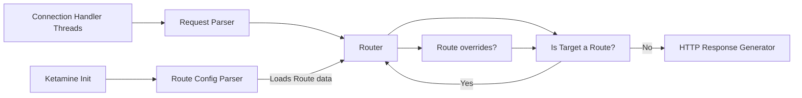

# Ketamine

A very simple HTTP server that you _probably_ shouldn't use because of security of whatever. It was written in the C
programming langauge,
which besides being my favourite, is also known for being quite easy to mess up terribly, especially when it comes
to software that deals content that was generated by random users (rather than a precisely tuned piece of software).
<br>
**TL; DR:** DO NOT USE UNLESS YOU ARE ACTIVELY LOOKING TO GET IN SERIOUS TROUBLE!

### The `routes` file

By default, ketamine looks for a file called `routes` in the same directory.
As the name suggests, this file specifies the routes for the server. The format is as follows:

```ebnf
<requested> ":" <target>
```

_Note: The parser for the routes file is very simple to enhance stability. It therefore does not support comments,
whitespaces, or other code beauty measures. It really must just be continuous lines of colon-separated key-value
pairs._

The **requested** field is the requested file or path, and **target** is what it should be mapped to.
Usually, the **requested** field corresponds to a regular path. There are, however, some builtin ketamine-intrinsic
routes that have special meanings:

| Requested Field | Purpose                                 | Example              |
|-----------------|-----------------------------------------|----------------------|
| `[root]`        | The root directory for all target files | `[root]:public_html` |

#### Integration

The functionality of the ketamine router during normal operation can be described as it being the middleware between the
request parser and the file I/O.

The following diagram describes the placement, as well as the functionality of the router

